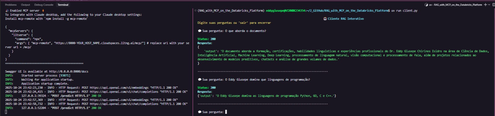

# <h1 align="center"><font color="gree">RAG with MCP on the Databricks Platform</font></h1>

<font color="pink">Senior Data Scientist.: Dr. Eddy Giusepe Chirinos Isidro</font>


Este projeto foi baseado no tutorial de [Aniket Maurya]().

Há soluções que combinam ``RAG`` com ``MCP``, onde o agente IA utiliza o MCP para acessar de maneira estruturada a dados e serviços externos que alimentarão o processo de recuperação e geração de conteúdo, promovendo um sistema autônomo, escalável e eficiente.


## <font color="red">Contextualizando</font>

### <font color="blue">MCP</font>

Model Context Protocol (MCP) é um protocolo que permite expor o contexto e funcionalidades de modelos de linguagem (``LLMs``) como serviços, facilitando a criação de sistemas de geração de texto assistida por recuperação (``RAG``). Um ``MCP server``, como no nosso código, oferece uma interface para um modelo de linguagem com integração de contexto externo (em nosso caso, documentos indexados), melhorando a qualidade e relevância das respostas.


### <font color="blue">server.py</font></font>

O arquivo server.py cria um ``servidor MCP`` que carrega documentos de uma pasta, indexa esses documentos usando um índice vetorial (``VectorStoreIndex``) e expõe uma API para receber consultas e gerar respostas baseadas no modelo OpenAI (``GPT-4.1-nano``). Esse servidor é o backend do sistema ``RAG``.

### <font color="blue">client.py</font></font>

O client.py é um cliente simples que conecta ao servidor ``MCP via HTTP``, enviando as perguntas (queries) para o endpoint ``/predict`` e exibindo as respostas. Ele serve para interagir com o servidor de forma amigável, seja manualmente ou programaticamente.


Em resumo, o servidor (``server.py``) processa e responde às perguntas usando contexto recuperado dos documentos, e o cliente ``(client.py)`` envia essas perguntas e mostra as respostas para o usuário. O ``MCP`` facilita essa arquitetura modular e conectável, especialmente para aplicações ``RAG``, onde o modelo consulta uma base de conhecimento externa para melhorar suas respostas.


## <font color="red">Explicando o uso do LitServe</font>

### <font color="blue">O que é LitServe?</font>

``LitServe`` é um framework Python desenvolvido pela [Lightning AI](https://pypi.org/project/litserve/) que facilita a criação de APIs de **inferência de modelos de Machine Learning** de forma simples e escalável. Ele gerencia automaticamente todo o ciclo de vida de uma API HTTP, permitindo que você foque apenas na lógica do modelo.

**Principais características:**
- 🚀 **Fácil de usar**: Basta herdar a classe base ``LitAPI`` e implementar ``4`` métodos
- ⚡ **Performático**: Otimizado para inferência de ML
- 🔄 **Gerenciamento automático**: Cuida de requisições HTTP, serialização, etc
- 📦 **Integração com MCP**: Suporte nativo para Model Context Protocol


### <font color="blue">Por que LitServe NÃO é como uma classe normal?</font>

A confusão é natural! Em uma classe normal Python, **VOCÊ** controla quando os métodos são executados. No LitServe, o **FRAMEWORK** controla o ciclo de vida e chama os métodos automaticamente baseado em eventos.

#### **Comparação: Classe Normal vs LitAPI**

**📌 CLASSE NORMAL**

```python
class MinhaCalculadora:
    def __init__(self):
        # Você chama ao criar: calc = MinhaCalculadora()
        print("Construtor executado!")
        self.valor = 0
    
    def somar(self, x):
        # VOCÊ chama explicitamente: calc.somar(5)
        self.valor += x
        return self.valor

# VOCÊ controla tudo:
calc = MinhaCalculadora()  # __init__ executado AQUI
resultado = calc.somar(5)  # VOCÊ chama o método quando quiser
print(resultado)           # 5
```

**📌 LITAPI (padrão de Framework):**

```python
class DocumentChatAPI(ls.LitAPI):
    def setup(self, device):
        # Similar ao __init__, mas chamado pelo LitServe
        print("Setup executado pelo framework!")
        self.query_engine = "engine inicializado"
    
    def decode_request(self, request):
        # LitServe chama quando recebe requisição HTTP
        return request.query
    
    def predict(self, query):
        # LitServe chama para processar a query
        return "resposta processada"
    
    def encode_response(self, output):
        # LitServe chama para formatar a resposta
        return {"output": output}

# VOCÊ NÃO controla diretamente:
api = DocumentChatAPI()      # setup NÃO é chamado ainda!
server = ls.LitServer(api)   # Apenas configura o servidor
server.run(port=8000)        # AQUI o LitServe assume o controle:
                             # 1. Chama setup() uma vez
                             # 2. Aguarda requisições HTTP
                             # 3. Para cada requisição, chama:
                             #    decode_request → predict → encode_response
```

**🔑 Diferença chave:** No LitAPI você **define o comportamento** (o "como fazer"), mas o **framework decide quando executar** (o "quando fazer").

### <font color="blue">Os 4 Métodos do LitAPI - Explicação Detalhada</font>

O ``LitAPI`` funciona com um padrão de **4 métodos** que você deve implementar. Cada um tem um propósito específico no ciclo de vida da API:


#### **1️⃣ `setup(self, device)` - O "Preparador"**

**📝 O que é:**
- Similar ao `__init__` de uma classe, mas com timing diferente
- É chamado **UMA ÚNICA VEZ** quando o servidor inicia (em `server.run()`)
- Serve para carregar recursos pesados que você NÃO quer recarregar a cada requisição

**⏰ Quando é chamado:**
- Automaticamente pelo ``LitServe`` quando `server.run(port=8000)` é executado
- Antes de aceitar qualquer requisição HTTP

**🎯 Para que serve:**
- Carregar modelos de ``ML`` (ex: ``GPT``, ``BERT``)
- Inicializar conexões com bancos de dados
- Carregar e indexar documentos (como no meu caso com o ``LlamaIndex``)
- Configurar recursos que serão reutilizados

**💡 Exemplo no nosso código:**

```python
def setup(self, device):
    # 1. Configurar o modelo LLM (OpenAI GPT-4.1-nano)
    Settings.llm = OpenAI(
        api_key=OPENAI_API_KEY,
        temperature=0.1,
        model=model,
    )
    
    # 2. Carregar TODOS os documentos da pasta data/
    documents = SimpleDirectoryReader(
        "/caminho/para/data"
    ).load_data()
    
    # 3. Criar índice vetorial (embeddings dos documentos)
    index = VectorStoreIndex.from_documents(documents)
    
    # 4. Inicializar query engine (usado no predict)
    self.query_engine = index.as_query_engine()
    
    # Tudo isso é feito 1 VEZ no início!
    # Requisições subsequentes usam esses recursos já carregados
```

**⚠️ Por que não usar `__init__`?**
- O ``LitServe`` precisa controlar quando inicializar (pode ser em workers diferentes)
- Permite passar informações de contexto (ex: ``device = "cpu"`` ou ``"cuda"``)
- Facilita reinicialização sem recriar o objeto


#### **2️⃣ `decode_request(self, request)` - O "Tradutor de Entrada"**

**📝 O que é:**
- Recebe a requisição HTTP bruta e extrai os dados relevantes
- Chamado **TODA VEZ** que uma requisição HTTP chega
- É o **PRIMEIRO** passo do processamento

**⏰ Quando é chamado:**
- Automaticamente quando o cliente faz: `POST http://localhost:8000/predict`
- Antes do método `predict()`

**🎯 Para que serve:**
- Extrair dados do ``JSON`` da requisição
- Validar formato dos dados (feito pelo ``Pydantic``)
- Transformar dados HTTP em formato que o modelo entende

**💡 Exemplo no nosso código:**

```python
def decode_request(self, request: RequestType):
    # request = RequestType(query="Qual a experiência do Dr. Eddy?")
    # 
    # Simplesmente extrai a string da query
    return request.query  # retorna: "Qual a experiência do Dr. Eddy?"
```

**🔄 Fluxo:**
```
Cliente envia:
POST /predict
{"query": "Qual a experiência do Dr. Eddy?"}
         ↓
LitServe recebe e cria objeto:
request = RequestType(query="Qual a experiência do Dr. Eddy?")
         ↓
decode_request(request) é chamado
         ↓
Retorna: "Qual a experiência do Dr. Eddy?"
         ↓
Este valor é passado para predict()
```


#### **3️⃣ `predict(self, query)` - O "Processador"**

**📝 O que é:**
- Recebe os dados decodificados e faz o processamento principal
- Aqui acontece a **lógica do modelo/IA**
- Chamado **TODA VEZ** após `decode_request()`

**⏰ Quando é chamado:**
- Automaticamente após `decode_request()` retornar
- É o **SEGUNDO** passo do processamento

**🎯 Para que serve:**
- Executar ``inferência`` do modelo de ``ML``
- Fazer consultas ao banco vetorial (``RAG``)
- Processar a lógica de negócio principal

**💡 Exemplo no nosso código:**

```python
def predict(self, query: str):
    # query = "Qual a experiência do Dr. Eddy?"
    
    # Usa o query_engine criado no setup()
    # Ele busca nos documentos indexados e gera resposta com ``GPT-4.1-nano``
    response = self.query_engine.query(query)
    
    # response é um objeto Response do LlamaIndex contendo:
    # - response.response: texto da resposta
    # - response.source_nodes: documentos relevantes usados
    # - response.metadata: informações adicionais
    
    return response
```

**🔄 Fluxo:**
```
decode_request() retornou:
"Qual a experiência do Dr. Eddy?"
         ↓
predict(query) é chamado com essa string
         ↓
Query engine busca nos documentos:
- Encontra trechos relevantes sobre experiência
- Envia contexto + pergunta para GPT-4.1-nano
- GPT gera resposta contextualizada
         ↓
Retorna objeto Response:
Response(
    response="O Dr. Eddy possui experiência em...",
    source_nodes=[...]
)
         ↓
Este objeto é passado para encode_response()
```


#### **4️⃣ `encode_response(self, output)` - O "Formatador de Saída"**

**📝 O que é:**
- Recebe o resultado do `predict()` e formata para JSON
- Chamado **TODA VEZ** após `predict()`
- É o **TERCEIRO** (último) passo do processamento

**⏰ Quando é chamado:**
- Automaticamente após `predict()` retornar
- Antes de enviar a resposta HTTP ao cliente

**🎯 Para que serve:**
- Converter ``objetos Python`` em ``dicionário JSON``
- Formatar a resposta no padrão esperado pelo cliente
- Adicionar metadados extras (``timestamp``, ``versão``, etc)

**💡 Exemplo no nosso código:**

```python
def encode_response(self, output) -> dict:
    # output é o objeto Response retornado por predict()
    
    # Extrai apenas o texto da resposta
    return {"output": output.response}
    
    # Poderia retornar mais informações:
    # return {
    #     "output": output.response,
    #     "sources": [node.text for node in output.source_nodes],
    #     "timestamp": datetime.now().isoformat()
    # }
```

**🔄 Fluxo:**
```
predict() retornou:
Response(response="O Dr. Eddy possui experiência em...")
         ↓
encode_response(output) é chamado
         ↓
Formata para dicionário JSON:
{"output": "O Dr. Eddy possui experiência em..."}
         ↓
LitServe envia resposta HTTP ao cliente:
HTTP/1.1 200 OK
Content-Type: application/json

{"output": "O Dr. Eddy possui experiência em..."}
```


### <font color="blue">Fluxo Completo - Do Início ao Fim</font>

Você pode acompanhar o que acontece desde quando você executa ``uv run server.py`` até o cliente receber a resposta:

#### **🚀 FASE 1: INICIALIZAÇÃO (acontece 1 vez)**

```bash
# Terminal 1: Iniciando o servidor
$ uv run server.py
```

```python
# O que acontece no código:

if __name__ == "__main__":
    # Passo 1: Criar instância da API
    api = DocumentChatAPI(
        mcp=MCP(description="...")
    )
    # ⚠️ setup() NÃO é chamado ainda!
    
    # Passo 2: Criar servidor
    server = ls.LitServer(api)
    
    # Passo 3: Iniciar servidor
    server.run(port=8000)
    # ✅ AQUI o LitServe chama: api.setup(device="cpu")
```

**O que acontece dentro do `setup()`:**

```
┌─────────────────────────────────────────────────┐
│  setup(device="cpu") é executado                │
├─────────────────────────────────────────────────┤
│  1. Configurar modelo OpenAI GPT-4.1-nano       |  
│     ⏱️  ~2 segundos                             
│                                                 | 
│  2. Carregar documentos da pasta data/          │
│     Lê todos os arquivos da pasta ``data/``     │
│     ⏱️  ~1-3 segundos                            
│                                                 │
│  3. Criar índice vetorial (``embeddings``)      │
│     🧮 Processa cada documento                  
│     ⏱️  ~5-10 segundos                         
│                                                 │
│  4. Inicializar ``query_engine``                │
│     ✅ Pronto para consultas                    
│                                                 │
└─────────────────────────────────────────────────┘

Servidor PRONTO! 🎉
Aguardando requisições em http://localhost:8000
```

**💡 Por que fazer isso no setup?**
- Carregar modelo e indexar documentos é **LENTO** (pode levar 10-15 segundos)
- Se fizéssemos isso a cada requisição, seria **INVIÁVEL**
- Fazendo 1 vez no início, as requisições são **RÁPIDAS** (milissegundos)

---

#### **📨 FASE 2: PROCESSAMENTO DE REQUISIÇÃO (toda vez)**

```bash
# Terminal 2: Cliente fazendo requisição
$ uv run client.py
Pergunta: Qual a experiência profissional do Dr. Eddy?
```

```python
# Cliente envia:
import requests
response = requests.post(
    "http://localhost:8000/predict",
    json={"query": "Qual a experiência profissional do Dr. Eddy Giusepe?"}
)
```

**O que acontece no servidor (automaticamente pelo LitServe):**

```
┌──────────────────────────────────────────────────────────┐
│  LitServe recebe requisição HTTP                         │
│  POST /predict                                           │
│  Body: {"query": "Qual a experiência..."}                |
└──────────────────────────────────────────────────────────┘
                          ↓
┌──────────────────────────────────────────────────────────┐
│  PASSO 1: decode_request()                               │
├──────────────────────────────────────────────────────────┤
│  Input:  RequestType(query="Qual a experiência...")      │
│  Ação:   Extrai a string da query                        │
│  Output: "Qual a experiência profissional do Dr. Eddy?"  │
│  ⏱️ < 1 milissegundo                                     
└──────────────────────────────────────────────────────────┘
                          ↓
┌──────────────────────────────────────────────────────────┐
│  PASSO 2: predict()                                      │
├──────────────────────────────────────────────────────────┤
│  Input:  "Qual a experiência profissional do Dr. Eddy?"  │
│                                                          │
│  Ação 1: Query engine busca documentos relevantes        │
│          - Calcula embedding da pergunta                 │
│          - Busca trechos similares no índice vetorial    │
│          - Encontra 3-5 chunks mais relevantes           │
│          ⏱️  ~50-100 ms                                 
│                                                          │
│  Ação 2: Envia contexto + pergunta para GPT-4.1-nano     │
│          - Monta prompt com contexto recuperado          │
│          - Chama API OpenAI                              │
│          - GPT gera resposta contextualizada             │
│          ⏱️  ~500-1500 ms                                │
│                                                          │
│  Output: Response(                                       │
│            response="O Dr. Eddy possui experiência       │
│                      em Data Science, com foco em..."    │
│          )                                               │
└──────────────────────────────────────────────────────────┘
                          ↓
┌──────────────────────────────────────────────────────────┐
│  PASSO 3: encode_response()                              │
├──────────────────────────────────────────────────────────┤
│  Input:  Response(response="O Dr. Eddy possui...")       │
│  Ação:   Extrai texto e formata em dicionário            │
│  Output: {"output": "O Dr. Eddy possui..."}              │
│  ⏱️  < 1 milissegundo                                    
└──────────────────────────────────────────────────────────┘
                          ↓
┌──────────────────────────────────────────────────────────┐
│  LitServe envia resposta HTTP ao cliente                 │
│  HTTP/1.1 200 OK                                         │
│  {"output": "O Dr. Eddy possui experiência em..."}       |
└──────────────────────────────────────────────────────────┘
                          ↓
┌──────────────────────────────────────────────────────────┐
│  Cliente recebe e exibe a resposta                       │
│  ✅ Resposta: "O Dr. Eddy possui experiência em..."     
└──────────────────────────────────────────────────────────┘

TEMPO TOTAL: ~600-1700 ms por requisição
```

### <font color="blue">Por que esse padrão é vantajoso?</font>

#### **✅ Vantagens do padrão LitAPI:**

1. **Separação de preocupações:**
   - Você foca na lógica do seu modelo de ``ML``
   - Framework cuida da infraestrutura

2. **Performance:**
   - Recursos pesados carregados 1 vez (``setup``)
   - Requisições subsequentes são rápidas

3. **Escalabilidade:**
   - ``LitServe`` pode criar múltiplos workers
   - Cada worker chama ``setup()`` uma vez
   - Todos processam requisições em paralelo

4. **Simplicidade:**
   - Você implementa ``4`` métodos simples
   - Framework cuida de ``HTTP``, ``serialização``, ``erros``, etc

#### **❌ Sem o LitServe (HTTP manual):**

```python
# Você teria que fazer tudo isso manualmente:
from flask import Flask, request, jsonify

app = Flask(__name__)

# Você gerencia tudo:
query_engine = None

@app.before_first_request
def setup():
    global query_engine
    # Inicializar modelo...
    query_engine = ...

@app.route('/predict', methods=['POST'])
def predict():
    # Validar entrada manualmente
    data = request.get_json()
    if 'query' not in data:
        return jsonify({"error": "missing query"}), 400
    
    # Processar
    query = data['query']
    response = query_engine.query(query)
    
    # Formatar saída manualmente
    return jsonify({"output": response.response})

# Gerenciar erros, logging, autenticação, etc manualmente...
app.run(port=8000)
```

**Com LitServe você foca só na lógica, não na ``infraestrutura``!**

---

### <font color="blue">Resumo Final - O que você precisa lembrar</font>

| Aspecto | Detalhes |
|---------|----------|
| **O que é LitServe?** | Framework que gerencia APIs de ML automaticamente |
| **setup()** | Inicialização (1 vez) - carregar recursos pesados |
| **decode_request()** | Extrair dados da requisição HTTP (toda requisição) |
| **predict()** | Processar lógica do modelo (toda requisição) |
| **encode_response()** | Formatar resposta em JSON (toda requisição) |
| **Quem chama?** | O FRAMEWORK chama automaticamente, não você |
| **Por que usar?** | Simplicidade + Performance + Escalabilidade |

**🔑 Chave para entender:**
```
Classe normal = Você manda
LitAPI = Framework manda, você obedece (implementa os métodos)
```


## <font color="red">Exemplo de uso do nosso RAG-MCP</font>



Thank God!